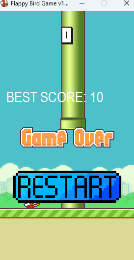
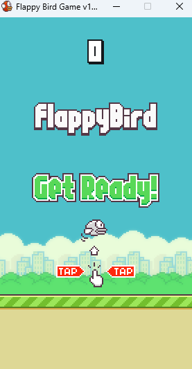
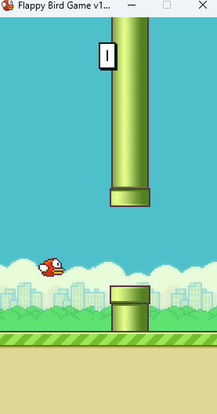

Запуск производить через main.py файл.
Перед запуском прописать pip install -r requirements.txt для установки нужных библиотек
Название проекта:Flappy Bird
Игра на pygame всеми известной игры 2013 года
Автор:Черноклинов Данила
Идея:Портировать мобильную игру на пк при помощи библиотеки pygame 
Реализация:Чуть чуть не успел доделать нормальный полет птички, ну и не доделал скины для нашей птицы, в остальном все что я хотел сделать, сделал.
Самое тяжелое что было по моему мнению делать это передвижение птицы
Управление сделано только на одну кнопку пробел. Так же есть сохранение лучших результатов

